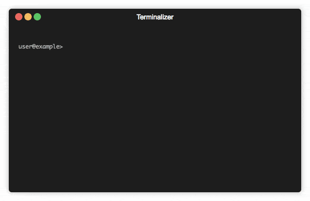

# iNoms
Interactive shell for [attic-labs/noms](https://github.com/attic-labs/noms)

Inoms is a wrapper around `noms` that makes it easier to manipulate a noms database by hand.

## Features
- Shows results of created objects directly
- Stores last result in a shell variable `$r` that you can use in your next command
- No need to specify the database for each command (without creating a nomsconfig)  


## Usage



Add `inoms` to your path variable


- starting the shell:

    ```bash
    inoms mydatabase
    ```

- run standard `noms` commands, just omit `noms` and the database spec (`mydatabase::`)

    ```bash
    noms list new mydatabase
    noms list append mydatabase::#somehash2378q3476 42
    ```
  
    becomes
    
    ```bash
    list new 
    list append $r 42
    ```
